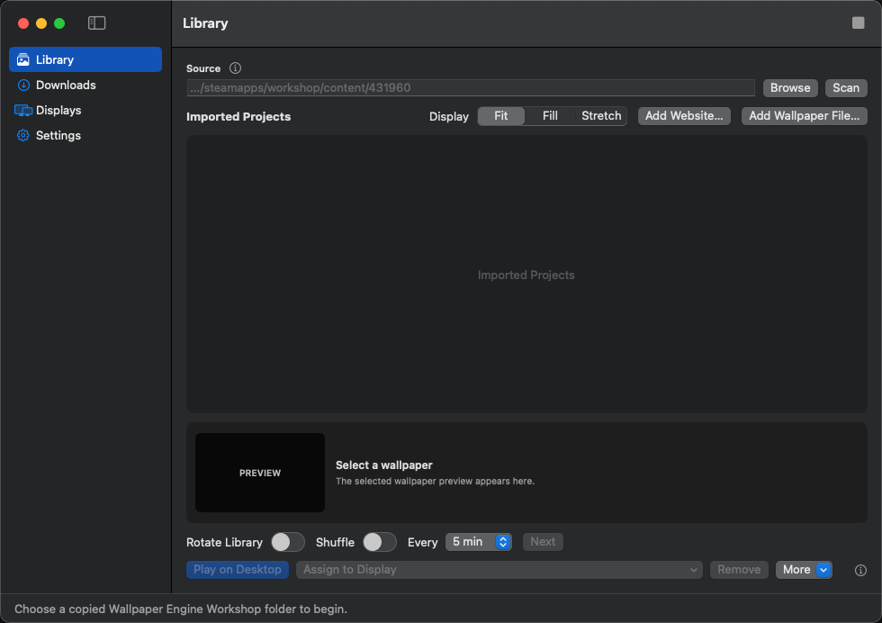
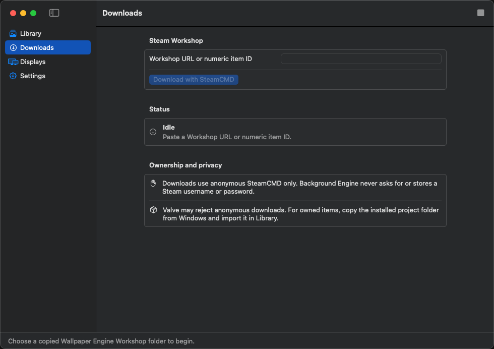
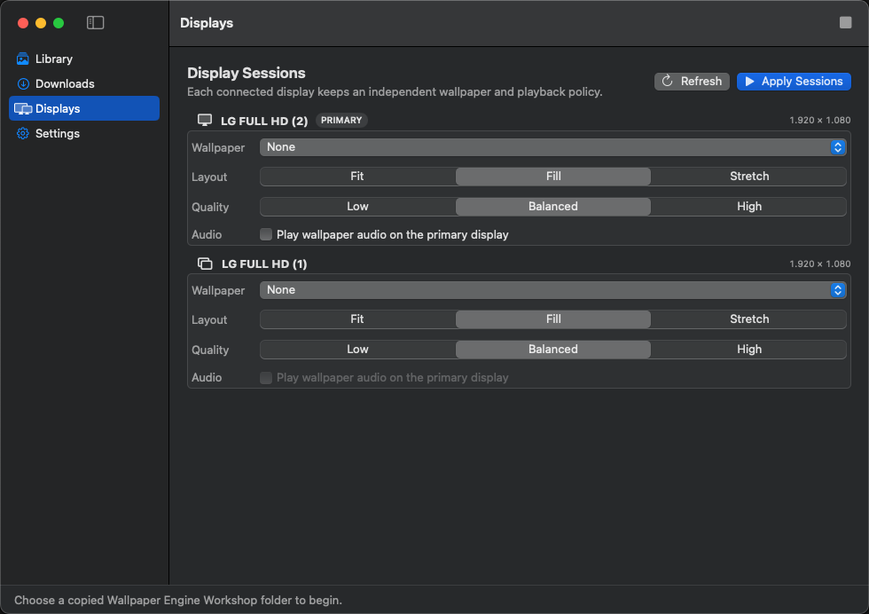
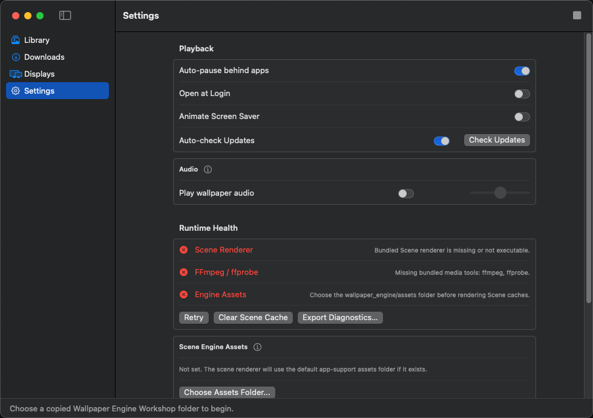

<p align="center">
  
</p>

<h1 align="center">Background Engine</h1>

<p align="center">
  A native, privacy-conscious wallpaper player for macOS.<br>
  Play legally acquired Wallpaper Engine projects across one or more displays.
</p>

<p align="center">
  
  
  
  
  
</p>



> [!IMPORTANT]
> Background Engine is an alpha project. Scene playback is best-effort and depends on the features used by each wallpaper. Users must provide their own legally acquired Wallpaper Engine content and engine assets.

## Current capabilities

- Import complete Wallpaper Engine project folders, standalone media files, Web URLs, and supported Wallpaper Engine Scene PKGV `.pkg` files.
- Download eligible Workshop items by URL or numeric ID through an anonymous, constrained SteamCMD XPC service for app ID `431960`.
- Play compatible video directly with AVFoundation and convert other valid local containers atomically with bundled FFmpeg.
- Render still images and frame-timed GIF, APNG, and WebP animation with ImageIO and bounded memory use.
- Run Web wallpapers through the self-hosted Plash runtime and a non-persistent, restricted WKWebView.
- Play compatible 2D Scenes live; render unsupported Scene features to a validated 20-second, 30 FPS MP4 cache when the external renderer and user-provided engine assets are available.
- Maintain an independent wallpaper, layout, quality, and playback session for every connected display.
- Use the active video or Scene cache in the bundled Universal screen saver when macOS locks the session.
- Pause for sleep, Low Power Mode, or a fully covered desktop, then restore playback and window ordering after wake, Space changes, and display reconnection.
- Store a versioned private library in `~/Library/Application Support/Background Engine` without modifying the original Workshop folder.
- Validate imports against path traversal, symbolic-link escapes, size limits, malformed packages, and duplicate content using SHA-256.
- Report renderer, FFmpeg/ffprobe, and engine-assets health; export redacted diagnostics without wallpaper assets or Steam information.
- No telemetry, account, cloud sync, Steam password collection, or embedded Workshop catalog.

Windows Application wallpapers are detected and labeled **Unsupported**. Every other imported project receives a visible **Full Live**, **Full Cached**, **Limited**, or **Unsupported** result with a reason.

## Screenshots

<table>
  <tr>
    <td width="50%"></td>
    <td width="50%"></td>
  </tr>
  <tr>
    <td align="center"><strong>Anonymous Workshop downloads</strong></td>
    <td align="center"><strong>Independent multi-display sessions</strong></td>
  </tr>
  <tr>
    <td colspan="2"></td>
  </tr>
  <tr>
    <td colspan="2" align="center"><strong>Playback controls, Runtime Health, engine assets, and diagnostics</strong></td>
  </tr>
</table>

The screenshots above are captured from the macOS application itself. No Wallpaper Engine content is included in this repository.

## Supported wallpaper types

| Type | Playback path | Notes |
| --- | --- | --- |
| Video | AVFoundation direct playback or atomic FFmpeg conversion | Content is probed instead of trusted by extension. Supported inputs include AVFoundation- or FFmpeg-readable local containers such as MP4, MOV, WebM, MKV, and AVI. File, folder, legacy-library, and SteamCMD imports all convert automatically when needed. Converted playback prefers VideoToolbox H.264 and uses bundled native MPEG-4/mp4v only when FFmpeg reports a recognized VideoToolbox session failure. It scales an odd dimension up by at most one pixel while preserving display aspect ratio, and preserves rotation, color metadata, and audio where possible; a failed conversion keeps the imported original and exposes a retryable diagnostic. Conversion cache keys include the recipe version, so a legacy cache stays playable but is flagged for a safe rebuild from the copied source. |
| Image | ImageIO still or animated playback | Supports ImageIO-readable images, including GIF, APNG, and WebP animation with source frame timing. |
| Web | PlashRuntime + restricted WKWebView | Supports local Web projects, ordinary website URLs, a native editor for boolean/slider/color/combo/text properties, sandboxed file/directory properties, callbacks registered after startup, pause callbacks, autoplay of local media, presentation CSS/JavaScript, print styles, and color inversion. Required local scripts/stylesheets are validated before playback across the complete bounded entrypoint, including executable inline script/style blocks, template-literal expressions, reachable static ES-module imports, and CSS `@import`, so incomplete projects are reported instead of opening a blank window. Script dependencies are collected only from executable/default/module script types; JSON, import-map, speculation-rule data blocks, and classic `nomodule` fallbacks remain inert on the macOS 14 module-capable Web runtime. Local `.js` and `.mjs` imports are recursively analyzed; other local literal specifiers are still checked for existence and project-root containment but are not parsed recursively. Required HTTP(S) dependencies remain blocked with an actionable `web_network_access_required` result until the user opts that wallpaper into external network access. Dependency probing is bounded and fails closed with `web_dependency_probe_limit_exceeded` when a project exceeds its safety limits. Audio visualization and Windows system-media integration receive neutral compatibility events and are labeled Limited. |
| Scene | Native live renderer or rendered Scene cache | Accepts Wallpaper Engine PKGV Scene packages. A macOS installer `.pkg` is not a wallpaper and is rejected. Full Scene cache rendering requires user-provided `wallpaper_engine/assets`. |
| Windows Application | None | Recognized and reported as **Unsupported**. Wine and CrossOver are outside this project's scope. |

### Compatibility labels

| Label | Meaning |
| --- | --- |
| **Full Live** | The wallpaper is rendered in real time with every detected required capability available. |
| **Full Cached** | The visual result is rendered ahead of time and played as a validated video loop. |
| **Limited** | The primary image, animation, and authored audio remain available, but a real-time feature such as mouse interaction, full SceneScript, or audio reactivity is approximated or unavailable. |
| **Unsupported** | The project cannot produce valid playback. The UI displays a stable diagnostic code and reason instead of opening a black wallpaper window. |

Scene classification combines static feature analysis with a small renderer preflight. A dark or intentionally static frame is a warning, not an automatic failure. Crashes, timeouts, missing frames, corrupt packages, and missing required assets are treated as hard failures.

## Multi-display playback

Background Engine keys assignments by the stable display UUID rather than the temporary display index. Each connected display has its own:

- Wallpaper assignment and playback session.
- **Fit**, **Fill**, or **Stretch** layout.
- **Low**, **Balanced**, or **High** quality selection.
- Recovery lifecycle when resolution, Retina scale, primary-display status, or connection state changes.

Wallpaper audio is off by default. When enabled, it plays only from the primary display so multiple sessions do not produce competing audio streams. A failure or cache job on one screen does not stop wallpapers on other screens.

## Importing wallpapers

### Local projects and files

1. Open **Library**.
2. Choose **Browse** and scan a copied `steamapps/workshop/content/431960` folder, or use **Add Wallpaper File…** for standalone media and Scene packages.
3. Select an imported wallpaper, choose its layout, and assign it to a display.

Imports are staged and committed atomically into Background Engine's private library. Existing source folders are never edited or deleted. Content hashes and Workshop IDs prevent duplicate copies.

### Web wallpapers

Choose **Add Website…** to add an HTTPS address. Web content uses ephemeral website storage, blocks downloads and native commands, rejects credential-bearing URLs, and restricts navigation to the trusted origin. Local Web projects cannot read files outside their project root. External network access for a local project remains disabled until the user enables it for that wallpaper.

The property bridge supports boolean, slider, color, combo, text, `applyUserProperties`, `applyGeneralProperties`, and `setPaused`. Use **Library → More → Customize Web Properties…** to edit scalar values; file and directory properties remain in the same menu and are copied into the wallpaper's private sandbox. Saving refreshes only displays currently using that wallpaper, and **Reset to Defaults** removes custom scalar overrides so future Workshop defaults can take effect. The bridge also defines Wallpaper Engine's Web media registration functions so a wallpaper can keep running when Windows media-session data is unavailable. Audio listeners receive a neutral 128-bin spectrum; media listeners receive disabled/empty status, metadata, thumbnail, playback, and timeline events. These wallpapers are labeled **Limited** because Background Engine does not capture system audio or expose Windows media sessions.

### Steam Workshop

1. Open **Downloads**.
2. Paste an official Steam Community Workshop URL or a numeric item ID.
3. Confirm installation of SteamCMD when prompted.
4. Assign the imported result from **Library** after the download completes.

SteamCMD runs anonymously and is only allowed to construct install, download, cancel, and diagnostic requests for Wallpaper Engine Workshop app ID `431960`. Background Engine never requests a Steam username, password, or Web API key, and it does not bypass ownership or Workshop permissions. If Valve denies anonymous access, install the item through Steam on Windows and copy the legally owned project folder to the Mac.

The SteamCMD installer accepts only a successful HTTPS response from Valve's pinned host. It bounds the compressed archive, entry list, expanded size, and extraction time; rejects traversal, duplicate paths, special files, data-directory collisions, and symlinks that leave the staging root; then swaps the complete runtime through same-volume directory renames. A durable transaction marker restores the previous runtime after an interrupted update without touching downloaded Workshop content.

## Scene playback and engine assets

Compatible 2D Scene features use the native parser and renderer. More complex Scenes use the bundled GPL renderer to produce a local MP4 cache through a raw video pipe and bundled FFmpeg. VideoToolbox H.264 is preferred, with a classified MPEG-4/mp4v recovery path when the macOS encoder session is unavailable. The output is validated before an atomic cache replacement; a failed render retries once at lower quality and never overwrites a known-good cache.

Scene cache identity includes the wallpaper content hash, renderer version, FFmpeg build ID, engine-assets fingerprint, resolution, and quality. Render jobs are bounded, deduplicated, cancellable, timed out, and terminated during sleep or app shutdown so renderer and FFmpeg child processes are not left behind.

Background Engine does not distribute proprietary Wallpaper Engine assets. To enable Scene cache rendering:

1. Open **Settings**.
2. Under **Scene Engine Assets**, choose a legally obtained `wallpaper_engine/assets` directory.
3. Review **Runtime Health** and use **Retry** after all required files are available.

Clock and text content can combine a cached base with a native live overlay. Full SceneScript interaction, mouse interaction, and audio-reactive behavior remain **Limited** in this milestone.

## Screen saver and lock behavior

The Universal `.saver` bundle can be installed for the current user and selected in System Settings. It reuses a compatible video or Scene cache. “Lock screen animation” means this screen saver can run while the macOS session is locked; Background Engine does not modify the login-window background.

## Privacy and security

- The application works locally and has no telemetry.
- Web storage is non-persistent, and external access is opt-in per wallpaper.
- User-selected folders use security-scoped bookmarks.
- SteamCMD is isolated behind a narrow XPC interface and cannot receive arbitrary shell commands.
- SteamCMD is validated in a private staging directory and installed transactionally; existing `steamapps` content is preserved.
- Diagnostics redact local paths and exclude wallpaper files, Steam IDs, and credentials.
- Release FFmpeg builds disable network protocols and device capture.
- Imported files are copied into the application library after traversal, symlink, decompression, and size validation.

## Requirements

- macOS 14 Sonoma or newer.
- Apple Silicon (`arm64`) or Intel (`x86_64`) Mac.
- Xcode 16 or newer to build from source; the CI release pipeline currently validates with a current macOS Xcode toolchain.
- User-provided Wallpaper Engine assets for rendered Scene caches.
- Legal access to every imported wallpaper and its dependencies.

The current source milestone is **v0.2.0-alpha.1, build 6**. Prebuilt artifacts, when published, are available from [GitHub Releases](https://github.com/LamPPKK/wallpaper-player-mac/releases).

## Build

Clone the repository, generate the Xcode project, then open it:

```sh
git clone https://github.com/LamPPKK/wallpaper-player-mac.git
cd wallpaper-player-mac
xcodegen generate
open "Background Engine.xcodeproj"
```

The app targets macOS 14+, uses Swift 6 strict concurrency, and produces Universal `arm64`/`x86_64` app, XPC, and screen-saver products. XcodeGen is required only when regenerating `Background Engine.xcodeproj` from `project.yml`.

Swift Package Manager can build the core, app executable, command-line tools, and tests:

```sh
DEVELOPER_DIR=/Applications/Xcode.app/Contents/Developer \
  xcrun swift build -c release --disable-sandbox

DEVELOPER_DIR=/Applications/Xcode.app/Contents/Developer \
  xcrun swift test --disable-sandbox
```

The external GPL Scene renderer has additional CMake dependencies. See [ExternalRenderers/README.md](ExternalRenderers/README.md).

Build the pinned, signed-source FFmpeg 9.0.1 runtime for both architectures and merge it into a local-only Universal runtime:

```sh
./Scripts/build-ffmpeg-runtime.sh /absolute/path/to/ffmpeg-universal-runtime
```

GnuPG and the build tools documented by the script are required. The Release app does not fall back to a Homebrew installation.

### Tests and command-line diagnostics

The repository includes unit, application, UI, media-runtime, renderer, packaging, concurrency, migration, and security regression tests. FFmpeg-dependent tests require the two runtime paths:

```sh
BACKGROUND_ENGINE_FFMPEG=/absolute/path/to/ffmpeg \
BACKGROUND_ENGINE_FFPROBE=/absolute/path/to/ffprobe \
DEVELOPER_DIR=/Applications/Xcode.app/Contents/Developer \
  xcrun swift test --disable-sandbox
```

`be-cli` provides local corpus tooling without copying owned Workshop content into Git:

```sh
swift run be-cli inventory /absolute/path/to/corpus
swift run be-cli scene-engine-info /absolute/path/to/wallpaper_engine/assets
swift run be-cli scene-parity-check \
  --windows /absolute/path/to/windows-reference.mp4 \
  --mac /absolute/path/to/mac-render.mp4 \
  --out /absolute/path/to/report \
  --size 1920x1080

# Or render a Scene deterministically and compare it with owned golden PNGs.
BACKGROUND_ENGINE_SCENE_RENDERER=/absolute/path/to/background-engine-scene-renderer \
BACKGROUND_ENGINE_SCENE_ASSETS_DIR=/absolute/path/to/wallpaper_engine/assets \
swift run be-cli scene-parity-check \
  /absolute/path/to/project/scene.pkg \
  /absolute/path/to/golden-frames \
  --out /absolute/path/to/golden-report
```

Parity report directories must not already exist. The tooling never overwrites
an owned corpus; it writes per-frame metrics, filtered renderer logs, and a
side-by-side contact sheet into a new report directory. The golden-frame mode
requires Xcode command-line tools plus the pinned local FFmpeg runtime.

## Project layout

| Path | Purpose |
| --- | --- |
| `Sources/BackgroundEngineCore` | Versioned models, importing, probing, migration, cache keys, validation, and reusable app logic. |
| `Sources/BackgroundEngineApp` | SwiftUI application, per-display sessions, Aerial-inspired video coordination, Plash Web playback, Scene playback, and diagnostics. |
| `Sources/SteamCMDRunnerService` | Constrained anonymous SteamCMD XPC service. |
| `Sources/BackgroundEngineScreenSaver` | Universal ScreenSaver.framework plug-in. |
| `ExternalRenderers` | Pinned GPL Scene renderer source and build documentation. |
| `Scripts` | Runtime builds, media smoke tests, parity tools, SBOM generation, signing, notarization, and packaging. |
| `Tests` | Core, app, script, runtime, packaging, and UI regression coverage. |

## Package a DMG

Create an unsigned development DMG from locally available runtimes:

```sh
./Scripts/package-app.sh
```

Create a Developer ID-signed and notarized release:

```sh
REQUIRE_SIGNING=1 REQUIRE_NOTARIZATION=1 \
SIGN_IDENTITY="Developer ID Application: Example (TEAMID)" \
NOTARY_PROFILE="background-engine-notary" \
SCENE_RENDERER_RUNTIME_DIR="/absolute/path/to/universal/scene-runtime" \
FFMPEG_RUNTIME_DIR="/absolute/path/to/ffmpeg-universal-runtime" \
./Scripts/package-app.sh
```

Release packaging fails closed unless the app, Scene renderer, FFmpeg, ffprobe, XPC service, and screen saver have valid `arm64` and `x86_64` slices. It verifies the renderer dependency closure and runtime paths, signs nested code before the app and DMG, submits with `notarytool`, staples the ticket, runs Gatekeeper assessment, and creates SHA-256, source, license, compatibility, and CycloneDX SBOM artifacts.

## Known limitations

- Windows Application wallpapers do not run through Wine or CrossOver.
- Scene compatibility is corpus-scoped; the Wallpaper Engine format and SceneScript API are broad and can change.
- Full SceneScript, mouse interaction, and audio-reactive system-audio capture are not classified as Full in v0.2.
- Anonymous SteamCMD availability is controlled by Valve and the Workshop item owner.
- The app does not include Wallpaper Engine engine assets or third-party Workshop projects.
- This alpha still requires physical-device validation for every Intel/Apple Silicon, sleep/wake, Spaces, lock, and multi-display release matrix before a stable release.

## Contributing

Bug reports should include the compatibility label, stable error code, feature fingerprint, macOS version, Mac architecture, and sanitized diagnostics exported from **Settings**. Do not attach paid Workshop content, Wallpaper Engine assets, Steam credentials, or personal filesystem paths.

Before submitting a change, run the relevant Swift tests and `git diff --check`. Changes to playback or packaging should also pass the Universal Xcode build and the applicable FFmpeg/renderer smoke tests.

## Legal and content ownership

Background Engine is licensed under the [GNU General Public License version 3](LICENSE). It is not affiliated with, endorsed by, or sponsored by Valve Corporation or Wallpaper Engine.

Users must own or otherwise be licensed to use Wallpaper Engine, imported content, references, and engine assets. Wallpaper Engine assets and Workshop projects are not redistributed by this repository. Valve may deny anonymous SteamCMD access; Background Engine does not work around that decision.

This project incorporates or adapts GPLv3 and MIT-licensed work from Open Wallpaper Engine, Workshop Wallpaper Bridge, wallpaperengine-mac-renderer, Aerial, and Plash. Pinned upstream revisions, license texts, FFmpeg build details, and distribution obligations are documented in [THIRD_PARTY_NOTICES.md](THIRD_PARTY_NOTICES.md). Contributors are listed in [AUTHORS](AUTHORS).
